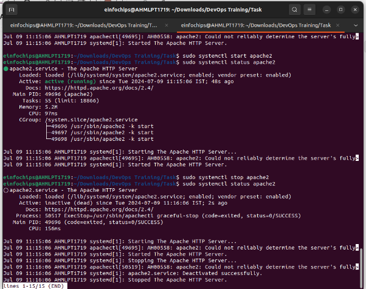

### **Comprehensive Linux Operations**
#### **Project Overview**
This project spans various aspects of Linux system administration, including file management, user and group management, service control, process handling, and more. You will be completing tasks that simulate real-world scenarios, providing hands-on experience with Linux commands and configurations.
### **Project Breakdown**
#### **Part 1: Creating and Editing Text Files (20 minutes)**
**Scenario:** You are tasked with documenting the configurations and settings for a new server. You'll use different text editors to create and update these documents.

1. **Using Nano**

Create a file server\_config.txt using Nano:

nano server\_config.txt

Add the following content:

Server Name: WebServer01

IP Address: 192.168.1.100

OS: Ubuntu 20.04

1. Save and exit (Ctrl+O, Enter, Ctrl+X).
1. **Using Vi**

Edit the same file with Vi:

vi server\_config.txt

Append the following text:

Installed Packages: Apache, MySQL, PHP

1. Save and exit (Esc, :wq).
1. **Using Vim**

Further edit the file with Vim:

vim server\_config.txt

Add the following text:

Configuration Complete: Yes

1. Save and exit (Esc, :wq).
#### **Part 2: User & Group Management (20 minutes)**
**Scenario:** You need to set up user accounts and groups for a new team joining the project.

1. **Adding/Removing Users**

**Add a new user developer:**

sudo adduser developer

![ref1]

**Remove the user developer:**

sudo deluser developer

![ref1]

1. **Managing Groups**

**Create a group devteam:**

sudo groupadd devteam

**Add the user developer to the devteam group:**

sudo usermod -aG devteam developer

**Remove the user developer from the devteam group:**

sudo gpasswd -d developer devteam

#### **Part 3: File Permissions Management (20 minutes)**
**Scenario:** Ensure that only the appropriate users have access to specific files and directories.

1. **Understanding File Permissions**

View permissions for server\_config.txt:

ls -l server\_config.txt

1. Discuss the output (e.g., -rw-r--r--).
1. **Changing Permissions and Ownership**

Change permissions to read/write for the owner and read-only for others:

chmod 644 server\_config.txt

![ref2]

Verify the change:

ls -l server\_config.txt

Change the owner to developer and the group to devteam:

sudo chown developer:devteam server\_config.txt

Verify the change:

ls -l server\_config.txt

![ref3]

#### **Part 4: Controlling Services and Daemons (20 minutes)**
**Scenario:** Manage the web server service to ensure it is running correctly and starts on boot.

1. **Managing Services with systemctl**

Start the Apache service:

sudo systemctl start apache2

Stop the Apache service:

sudo systemctl stop apache2

Enable the Apache service to start on boot:

sudo systemctl enable apache2

Disable the Apache service:

sudo systemctl disable apache2

![ref4]

Check the status of the Apache service:

sudo systemctl status apache2

![ref4]

1. **Understanding Daemons**
   1. Discuss the role of the sshd daemon in providing SSH access to the server.
#### **Part 5: Process Handling (20 minutes)**
**Scenario:** Monitor and manage processes to ensure the server is performing optimally.

1. **Viewing Processes**

List all running processes:

ps aux

Use top to view processes in real-time:

top

1. **Managing Processes**

Identify a process to kill using ps or top, then kill it:

kill <PID>

Change the priority of a process (e.g., running sleep with a lower priority):

nice -n 10 sleep 100 &

Change the priority of the process using renice:

renice +10 <PID>

### **Creating and Deploying a Static Website with Apache2**
#### **Preparation (5 minutes)**
- Ensure you have access to a Linux environment (e.g., virtual machines, EC2 instances, or local installations) with sudo privileges.
### **Activity Breakdown**
#### **Part 1: Installing Apache2 (5 minutes)**
1. **Update Package Lists**

Open the terminal and run:

sudo apt update

1. **Install Apache2**

Install Apache2 by running:

sudo apt install apache2

1. **Start and Enable Apache2**

Start the Apache2 service:

sudo systemctl start apache2

Enable Apache2 to start on boot:

sudo systemctl enable apache2

1. **Verify Installation**
   1. Open a web browser and navigate to http://your\_server\_ip. You should see the Apache2 default page.

      
#### **Part 2: Creating the Website (10 minutes)**
1. **Navigate to the Web Directory**

Change to the web root directory:

cd /var/www/html

1. **Create a New Directory for the Website**

Create a directory named mystaticwebsite:

sudo mkdir mystaticwebsite

Change ownership of the directory:

sudo chown -R $USER:$USER /var/www/html/mystaticwebsite

1. **Create HTML File**

Create and edit the index.html file:

nano /var/www/html/mystaticwebsite/index.html

Add the following content:

<!DOCTYPE html>

<html>

<head>

`  `<title>My Static Website</title>

`  `<link rel="stylesheet" type="text/css" href="styles.css">

</head>

<body>

`  `<h1>Welcome to My Static Website</h1>

`  `
This is a simple static website using Apache2.

`  `

</body>

</html>

1. Save and exit (Ctrl+O, Enter, Ctrl+X).
1. **Create CSS File**

Create and edit the styles.css file:

nano /var/www/html/mystaticwebsite/styles.css

Add the following content:

body {

`  `font-family: Arial, sans-serif;

`  `background-color: #f0f0f0;

`  `text-align: center;

`  `margin: 0;

`  `padding: 20px;

}

h1 {

`  `color: #333;

}

1. Save and exit (Ctrl+O, Enter, Ctrl+X).
1. **Create JavaScript File**

Create and edit the script.js file:

nano /var/www/html/mystaticwebsite/script.js

Add the following content:

document.addEventListener('DOMContentLoaded', function() {

`  `console.log('Hello, World!');

});

1. Save and exit (Ctrl+O, Enter, Ctrl+X).
1. **Add an Image**

Download or copy an image file (e.g., logo.png) to the website directory:

cp /path/to/your/logo.png /var/www/html/mystaticwebsite/logo.png

Update index.html to include the image:

<body>

`  `<h1>Welcome to My Static Website</h1>

`  `

`  `
This is a simple static website using Apache2.

`  `

</body>

#### **Part 3: Configuring Apache2 to Serve the Website (10 minutes)**
1. **Create a Virtual Host File**

Create and edit the virtual host configuration file:

sudo nano /etc/apache2/sites-available/mystaticwebsite.conf

Add the following content:

<VirtualHost \*:80>

`  `ServerAdmin webmaster@localhost

`  `DocumentRoot /var/www/html/mystaticwebsite

`  `ErrorLog ${APACHE\_LOG\_DIR}/error.log

`  `CustomLog ${APACHE\_LOG\_DIR}/access.log combined

</VirtualHost>

1. Save and exit (Ctrl+O, Enter, Ctrl+X).
1. **Enable the New Virtual Host**

Enable the virtual host configuration:

sudo a2ensite mystaticwebsite.conf

1. **Disable the Default Site**

Disable the default site configuration:

sudo a2dissite 000-default.conf

1. **Reload Apache2**

Reload the Apache2 service to apply the changes:

sudo systemctl reload apache2

1. **Test the Configuration**
   1. Open a web browser and navigate to http://your\_server\_ip. You should see the static website with the HTML, CSS, JS, and image.

      

[ref1]: Aspose.Words.2e32810f-c131-4c7a-a162-965b3bbb2e64.004.png
[ref2]: Aspose.Words.2e32810f-c131-4c7a-a162-965b3bbb2e64.009.png
[ref3]: Aspose.Words.2e32810f-c131-4c7a-a162-965b3bbb2e64.010.png
[ref4]: Aspose.Words.2e32810f-c131-4c7a-a162-965b3bbb2e64.014.png
