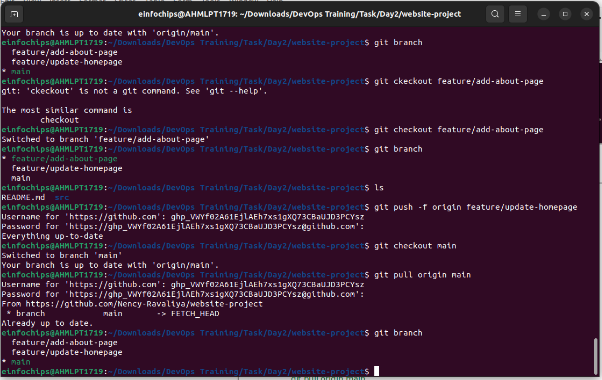
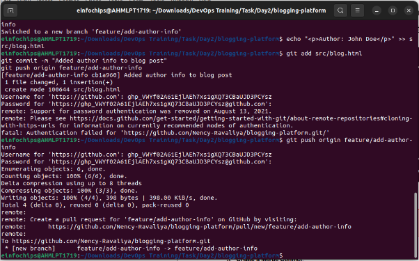
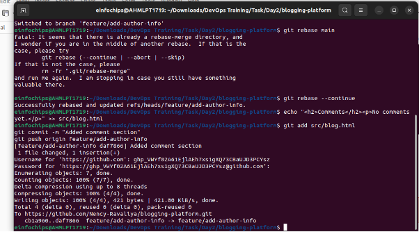

### **Git Project (2.5 Hours)**
#### **Objective:**
You will work on a project involving a simple website. You will learn and practice various Git concepts including branching, merging, handling merge conflicts, rebasing, pulling, versioning, and rolling back changes. This project is designed to be completed in 1 hour.

![ref1]
#### **Project Setup (15 minutes)**
1. **Install Git**: Ensure Git is installed on your system. Verify with git --version.

**Set Up Git**: Configure your Git username and email:

git config --global user.name "Your Name"

git config --global user.email "your.email@example.com"

1. **Create a GitHub Repository**:
   1. Go to GitHub and create a new repository named website-project.

Clone the repository to your local machine:

git clone [https://github.com/your-username/website-project.git]()

1. **Initialize the Project**:

Navigate to the project directory:

cd website-project

Create initial project structure:

mkdir src

touch src/index.html

echo "<!DOCTYPE html><html><head><title>My Website</title></head><body><h1>Welcome to my website!</h1></body></html>" > src/index.html

Commit and push the initial project structure:

git add .	

git commit -m "Initial commit: Added project structure and index.html"

git push origin main

![ref1]
#### **Exercise 1: Branching and Basic Operations (10 minutes)**
**Create a New Branch**:

git checkout -b feature/add-about-page

1. **Add a New Page**:

Create about.html:

touch src/about.html

echo "<!DOCTYPE html><html><head><title>About Us</title></head><body><h1>About Us</h1></body></html>" > src/about.html

Commit and push changes:

git add src/about.html

git commit -m "Added about page"

git push origin feature/add-about-page

![ref1]
#### **Exercise 2: Merging and Handling Merge Conflicts (15 minutes)**
**Create Another Branch**:

git checkout main

git checkout -b feature/update-homepage

1. **Update the Homepage**:

Modify index.html:

echo "
Updated homepage content
" >> src/index.html

Commit and push changes:

git add src/index.html

git commit -m "Updated homepage content"

git push origin feature/update-homepage

1. **Create a Merge Conflict**:

Modify index.html on the feature/add-about-page branch:

git checkout feature/add-about-page

echo "
Conflict content
" >> src/index.html

git add src/index.html

git commit -m "Added conflicting content to homepage"

git push origin feature/add-about-page

1. **Merge and Resolve Conflict**:

Attempt to merge feature/add-about-page into main:

git checkout main

git merge feature/add-about-page

Resolve the conflict in src/index.html, then:

git add src/index.html

git commit -m "Resolved merge conflict in homepage"

git push origin main

![ref1]
#### **Exercise 3: Rebasing (10 minutes)**
1. **Rebase a Branch**:

Rebase feature/update-homepage onto main:

git checkout feature/update-homepage

git rebase main

1. Resolve any conflicts that arise during rebase.

**Push the Rebased Branch**:

git push -f origin feature/update-homepage

![ref1]
#### **Exercise 4: Pulling and Collaboration (10 minutes)**
1. **Pull Changes from Remote**:

Ensure the main branch is up-to-date:

git checkout main

git pull origin main

1. **Simulate a Collaborator's Change**:
   1. Make a change on GitHub directly (e.g., edit index.html).
1. **Pull Collaborator's Changes**:

Pull the changes made by the collaborator:

git pull origin main

![ref1]
#### **Exercise 5: Versioning and Rollback (15 minutes)**
1. **Tagging a Version**:

Tag the current commit as v1.0:

git tag -a v1.0 -m "Version 1.0: Initial release"

git push origin v1.0

1. **Make a Change that Needs Reversion**:

Modify index.html:

echo "
Incorrect update
" >> src/index.html

git add src/index.html

git commit -m "Incorrect update"

git push origin main

1. **Revert to a Previous Version**:

Use git revert to undo the last commit:

git revert HEAD

git push origin main

Alternatively, reset to a specific commit (use with caution):
sh
Copy code
git reset --hard v1.0

git push -f origin main

![ref1]
#### **Extra Activities (10 minutes)**
1. **Stashing Changes**:

Make some local changes without committing:

echo "
Uncommitted changes
" >> src/index.html

Stash the changes:

git stash

Apply the stashed changes:

git stash apply

1. **Viewing Commit History**:

Use git log to view commit history:

git log –oneline

1. **Cherry-Picking Commits**:

Create a new branch and cherry-pick a commit from another branch:

git checkout -b feature/cherry-pick

git cherry-pick <commit-hash>

git push origin feature/cherry-pick

1. **Interactive Rebase**:

Use interactive rebase to squash commits:

git checkout main

git rebase -i HEAD~3

###
###
###
###
###
###
###
###
### **Collaborative Blogging Platform**
#### **Objective:**
You will work on a project to collaboratively develop a simple blogging platform. You will practice various Git concepts including branching, merging, handling merge conflicts, rebasing, pulling, versioning, rolling back changes, stashing, and cherry-picking commits. The project is designed to be completed in 1.5 Hours

![ref2]

1. **Create a GitHub Repository**:
   1. Go to GitHub and create a new repository named blogging-platform.

Clone the repository to your local machine:

git clone https://github.com/your-username/blogging-platform.git

1. **Initialize the Project**:

Navigate to the project directory:

cd blogging-platform

Create initial project structure:

mkdir src

touch src/index.html

echo "<!DOCTYPE html><html><head><title>Blogging Platform</title></head><body><h1>Welcome to the Blogging Platform!</h1></body></html>" > src/index.html

Commit and push the initial project structure:

git add .

git commit -m "Initial commit: Added project structure and index.html"

git push origin main

![ref2]
#### **Exercise 1: Branching and Adding Features (20 minutes)**
**Create a New Branch for Blog Post Feature**:

git checkout -b feature/add-blog-post

1. **Add a Blog Post Page**:

Create blog.html:

touch src/blog.html

echo "<!DOCTYPE html><html><head><title>Blog Post</title></head><body><h1>My First Blog Post</h1></body></html>" > src/blog.html

Commit and push changes:

git add src/blog.html

git commit -m "Added blog post page"

git push origin feature/add-blog-post

![ref2]
#### **Exercise 2: Collaborating with Merging and Handling Merge Conflicts (25 minutes)**
**Create Another Branch for Author Info**:

git checkout main

git checkout -b feature/add-author-info

1. **Add Author Info to Blog Page**:

Modify blog.html:

echo "
Author: John Doe
" >> src/blog.html

Commit and push changes:

git add src/blog.html

git commit -m "Added author info to blog post"

git push origin feature/add-author-info

1. **Create a Merge Conflict**:

Modify blog.html on the feature/add-blog-post branch:

git checkout feature/add-blog-post

echo "
Published on: July 10, 2024
" >> src/blog.html

git add src/blog.html

git commit -m "Added publish date to blog post"

git push origin feature/add-blog-post

1. **Merge and Resolve Conflict**:

Attempt to merge feature/add-blog-post into main:

git checkout main

git merge feature/add-blog-post

Resolve the conflict in src/blog.html, then:

git add src/blog.html

git commit -m "Resolved merge conflict in blog post"

git push origin main

![ref2]
#### **Exercise 3: Rebasing and Feature Enhancement (25 minutes)**
1. **Rebase a Branch for Comment Feature**:

Rebase feature/add-author-info onto main:

git checkout feature/add-author-info

git rebase main

1. Resolve any conflicts that arise during rebase.
1. **Add Comment Section**:

Modify blog.html to add a comment section:

echo "<h2>Comments</h2>
No comments yet.
" >> src/blog.html

git add src/blog.html

git commit -m "Added comment section"

git push origin feature/add-author-info

![ref2]
#### **Exercise 4: Pulling and Simulating Collaboration (20 minutes)**
1. **Pull Changes from Remote**:

Ensure the main branch is up-to-date:

git checkout main

git pull origin main

![ref3]

1. **Simulate a Collaborator's Change**:
   1. Make a change on GitHub directly (e.g., edit blog.html to add a new comment).
1. **Pull Collaborator's Changes**:

Pull the changes made by the collaborator:

git pull origin main

![ref3]

![ref2]
#### **Exercise 5: Versioning and Rollback (30 minutes)**
1. **Tagging a Version**:

Tag the current commit as v1.0:

git tag -a v1.0 -m "Version 1.0: Initial release"

git push origin v1.0

1. **Make a Change that Needs Reversion**:

Modify blog.html:

echo "
Incorrect comment
" >> src/blog.html

git add src/blog.html

git commit -m "Incorrect comment update"

git push origin main

1. **Revert to a Previous Version**:

Use git revert to undo the last commit:

git revert HEAD

git push origin main

Alternatively, reset to a specific commit (use with caution):

git reset --hard v1.0

git push -f origin main

![ref2]
#### **Extra Activities (25 minutes)**
1. **Stashing Changes**:

Make some local changes without committing:

echo "
Uncommitted changes
" >> src/blog.html

Stash the changes:

git stash

Apply the stashed changes:

git stash apply

1. **Viewing Commit History**:

Use git log to view commit history:

git log –oneline

1. **Cherry-Picking Commits**:

Create a new branch and cherry-pick a commit from another branch:

git checkout -b feature/cherry-pick

git cherry-pick <commit-hash>

git push origin feature/cherry-pick

1. **Interactive Rebase**:

Use interactive rebase to squash commits:

git checkout main

git rebase -i HEAD~3

####

[ref1]: Aspose.Words.3cecf3cb-c13e-47c4-b68a-196e68dda26f.001.png
[ref2]: Aspose.Words.3cecf3cb-c13e-47c4-b68a-196e68dda26f.022.png
[ref3]: Aspose.Words.3cecf3cb-c13e-47c4-b68a-196e68dda26f.035.png
