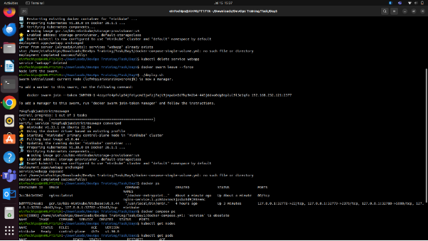

## **Project 01 - 1 Hour**
## **Deploying a Scalable Web Application with Persistent Storage and Advanced Automation**
### **Objective:**
Deploy a scalable web application using Docker Swarm and Kubernetes, ensuring data persistence using a single shared volume, and automate the process using advanced shell scripting.
### **Overview:**
1. **Step 1**: Set up Docker Swarm and create a service.
1. **Step 2**: Set up Kubernetes using Minikube.
1. **Step 3**: Deploy a web application using Docker Compose.
1. **Step 4**: Use a single shared volume across multiple containers.
1. **Step 5**: Automate the entire process using advanced shell scripting.

![ref1]
### **Step 1: Set up Docker Swarm and Create a Service**
#### **1.1 Initialize Docker Swarm**

\# Initialize Docker Swarm

docker swarm init

#### **1.2 Create a Docker Swarm Service**

\# Create a simple Nginx service in Docker Swarm

docker service create --name nginx-service --publish 8080:80 nginx

### **Step 2: Set up Kubernetes Using Minikube**
#### **2.1 Start Minikube**

\# Start Minikube

minikube start

#### **2.2 Deploy a Web App on Kubernetes**
Create a deployment file named webapp-deployment.yaml:

apiVersion: apps/v1

kind: Deployment

metadata:

`  `name: webapp

spec:

`  `replicas: 3

`  `selector:

`    `matchLabels:

`      `app: webapp

`  `template:

`    `metadata:

`      `labels:

`        `app: webapp

`    `spec:

`      `containers:

`      `- name: webapp

`        `image: nginx

`        `ports:

`        `- containerPort: 80

Apply the deployment:

kubectl apply -f webapp-deployment.yaml

#### **2.3 Expose the Deployment**
kubectl expose deployment webapp --type=NodePort –port=80

###
###
### **Step 3: Deploy a Web Application Using Docker Compose**
#### **3.1 Create a docker-compose.yml File**

version: '3'

services:

`  `web:

`    `image: nginx

`    `ports:

`      `- "8080:80"

`    `volumes:

`      `- webdata:/usr/share/nginx/html

volumes:

`  `webdata:

#### **3.2 Deploy the Web Application**

\# Deploy using Docker Compose

docker-compose up -d

### **Step 4: Use a Single Shared Volume Across Multiple Containers**
#### **4.1 Update docker-compose.yml to Use a Shared Volume**

version: '3'

services:

`  `web1:

`    `image: nginx

`    `ports:

`      `- "8081:80"

`    `volumes:

`      `- shareddata:/usr/share/nginx/html

`  `web2:

`    `image: nginx

`    `ports:

`      `- "8082:80"

`    `volumes:

`      `- shareddata:/usr/share/nginx/html

volumes:

`  `shareddata:

#### **4.2 Deploy with Docker Compose**

\# Deploy using Docker Compose

docker-compose up -d

### **Step 5: Automate the Entire Process Using Advanced Shell Scripting**
#### **5.1 Create a Shell Script deploy.sh**

#!/bin/bash

\# Initialize Docker Swarm

docker swarm init

\# Create Docker Swarm Service

docker service create --name nginx-service --publish 8080:80 nginx

\# Start Minikube

minikube start

\# Create Kubernetes Deployment

kubectl apply -f webapp-deployment.yaml

\# Expose the Deployment

kubectl expose deployment webapp --type=NodePort --port=80

\# Deploy Web App Using Docker Compose

docker-compose -f docker-compose-single-volume.yml up -d

echo "Deployment completed successfully!"

#### **5.2 Make the Script Executable**

\# Make the script executable

chmod +x deploy.sh

#### **5.3 Run the Script**

\# Run the deployment script

./deploy.sh

### 
###
###
###
### **Project 02 - 1 Hour**
### **Comprehensive Deployment of a Multi-Tier Application with CI/CD Pipeline**
### **Objective:**
Deploy a multi-tier application (frontend, backend, and database) using Docker Swarm and Kubernetes, ensuring data persistence using a single shared volume across multiple containers, and automating the entire process using advanced shell scripting and CI/CD pipelines.
### **Overview:**
1. **Step 1**: Set up Docker Swarm and create a multi-tier service.
1. **Step 2**: Set up Kubernetes using Minikube.
1. **Step 3**: Deploy a multi-tier application using Docker Compose.
1. **Step 4**: Use a single shared volume across multiple containers.
1. **Step 5**: Automate the deployment process using advanced shell scripting.

![ref1]
### **Step 1: Set up Docker Swarm and Create a Multi-Tier Service**
#### **1.1 Initialize Docker Swarm**

\# Initialize Docker Swarm

docker swarm init

#### **1.2 Create a Multi-Tier Docker Swarm Service**
Create a docker-compose-swarm.yml file:

version: '3.7'

services:

`  `frontend:

`    `image: nginx

`    `ports:

`      `- "8080:80"

`    `deploy:

`      `replicas: 2

`    `volumes:

`      `- shareddata:/usr/share/nginx/html

`  `backend:

`    `image: mybackendimage

`    `ports:

`      `- "8081:80"

`    `deploy:

`      `replicas: 2

`    `volumes:

`      `- shareddata:/app/data

`  `db:

`    `image: postgres

`    `environment:

`      `POSTGRES\_DB: mydb

`      `POSTGRES\_USER: user

`      `POSTGRES\_PASSWORD: password

`    `deploy:

`      `replicas: 1

`    `volumes:

`      `- dbdata:/var/lib/postgresql/data

volumes:

`  `shareddata:

`  `dbdata:

Deploy the stack:

\# Deploy the stack using Docker Swarm

docker stack deploy -c docker-compose-swarm.yml myapp

### **Step 2: Set up Kubernetes Using Minikube**
#### **2.1 Start Minikube**

\# Start Minikube

minikube start

#### **2.2 Create Kubernetes Deployment Files**
Create frontend-deployment.yaml:

apiVersion: apps/v1

kind: Deployment

metadata:

`  `name: frontend

spec:

`  `replicas: 2

`  `selector:

`    `matchLabels:

`      `app: frontend

`  `template:

`    `metadata:

`      `labels:

`        `app: frontend

`    `spec:

`      `containers:

`      `- name: frontend

`        `image: nginx

`        `ports:

`        `- containerPort: 80

`        `volumeMounts:

`        `- name: shareddata

`          `mountPath: /usr/share/nginx/html

`      `volumes:

`      `- name: shareddata

`        `persistentVolumeClaim:

`          `claimName: shared-pvc

Create backend-deployment.yaml:

apiVersion: apps/v1

kind: Deployment

metadata:

`  `name: backend

spec:

`  `replicas: 2

`  `selector:

`    `matchLabels:

`      `app: backend

`  `template:

`    `metadata:

`      `labels:

`        `app: backend

`    `spec:

`      `containers:

`      `- name: backend

`        `image: mybackendimage

`        `ports:

`        `- containerPort: 80

`        `volumeMounts:

`        `- name: shareddata

`          `mountPath: /app/data

`      `volumes:	

`      `- name: shareddata

`        `persistentVolumeClaim:

`          `claimName: shared-pvc

Create db-deployment.yaml:

apiVersion: apps/v1

kind: Deployment

metadata:

`  `name: db

spec:

`  `replicas: 1

`  `selector:

`    `matchLabels:

`      `app: db

`  `template:

`    `metadata:

`      `labels:

`        `app: db

`    `spec:

`      `containers:

`      `- name: db

`        `image: postgres

`        `env:

`        `- name: POSTGRES\_DB

`          `value: mydb

`        `- name: POSTGRES\_USER

`          `value: user

`        `- name: POSTGRES\_PASSWORD

`          `value: password

`        `volumeMounts:

`        `- name: dbdata

`          `mountPath: /var/lib/postgresql/data

`      `volumes:

`      `- name: dbdata

`        `persistentVolumeClaim:

`          `claimName: db-pvc

Create shared-pvc.yaml:

apiVersion: v1

kind: PersistentVolumeClaim

metadata:

`  `name: shared-pvc

spec:

`  `accessModes:

`  `- ReadWriteMany

`  `resources:

`    `requests:

`      `storage: 1Gi

Create db-pvc.yaml:

apiVersion: v1

kind: PersistentVolumeClaim

metadata:

`  `name: db-pvc

spec:

`  `accessModes:

`  `- ReadWriteOnce

`  `resources:

`    `requests:

`      `storage: 1Gi

Apply the deployments:

kubectl apply -f shared-pvc.yaml

kubectl apply -f db-pvc.yaml

kubectl apply -f frontend-deployment.yaml

kubectl apply -f backend-deployment.yaml

kubectl apply -f db-deployment.yaml

### **Step 3: Deploy a Multi-Tier Application Using Docker Compose**
#### **3.1 Create a docker-compose.yml File**

version: '3'

services:

`  `frontend:

`    `image: nginx

`    `ports:

`      `- "8080:80"

`    `volumes:

`      `- shareddata:/usr/share/nginx/html

`  `backend:

`    `image: mybackendimage

`    `ports:

`      `- "8081:80"

`    `volumes:

`      `- shareddata:/app/data

`  `db:

`    `image: postgres

`    `environment:

`      `POSTGRES\_DB: mydb

`      `POSTGRES\_USER: user

`      `POSTGRES\_PASSWORD: password

`    `volumes:

`      `- dbdata:/var/lib/postgresql/data

volumes:

`  `shareddata:

`  `dbdata:

#### **3.2 Deploy the Application**

\# Deploy using Docker Compose

docker-compose up -d

### **Step 4: Use a Single Shared Volume Across Multiple Containers**
Update docker-compose.yml as shown in Step 3.1 to use the shareddata volume across the frontend and backend services.

[ref1]: Aspose.Words.6e3d0260-2c71-488e-a943-56d71b5f0621.001.png
